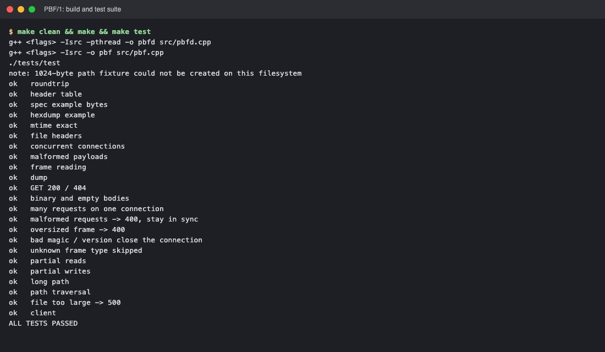
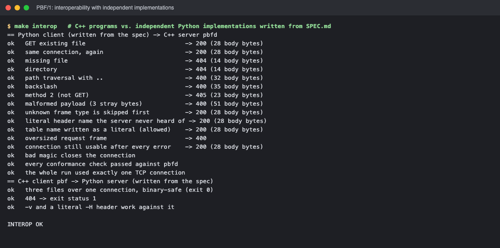
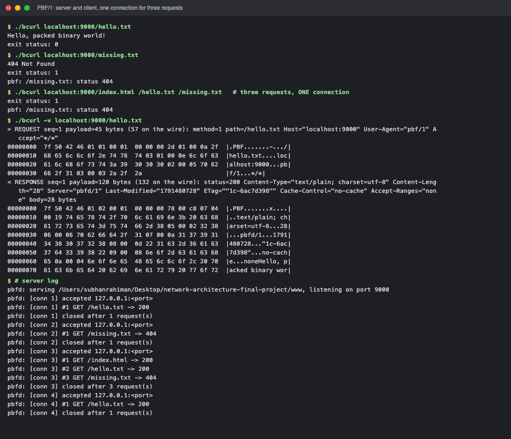

# PBF/1 — Packed Binary Fetch: HTTP, in binary

Two small C++17 programs that speak **PBF/1** ("Packed Binary Fetch"), a custom binary
request/response protocol over TCP. It borrows HTTP's ideas — method, path, headers,
status code, body — and none of its text. Every message is a frame with a 12-byte header;
one two-page specification, [SPEC.md](SPEC.md), covers both programs.

What is handed in, as the course project asks:

1. **The spec** — [SPEC.md](SPEC.md), two pages, enough for a stranger (the reasoning is in [docs/DESIGN.md](docs/DESIGN.md)).
2. **The programs** — the server `pbfd` (alias `bserve`) and the client `pbf` (alias `bcurl`).
3. **An annotated hexdump of one complete request and response** — [HEXDUMP.md](HEXDUMP.md), generated from the real bytes.

| Program | Alias    | Role   | Usage |
|---------|----------|--------|-------|
| `pbfd`  | `bserve` | server | `./bserve <document_root> <port>` |
| `pbf`   | `bcurl`  | client | `./bcurl [-v] [-H "Name: value" ...] host:port/path [/path \| host:port/path ...]` |

C++17, plain BSD sockets (Winsock on Windows), no third-party libraries. The server handles
each connection on its own thread; the client is single-threaded.

## Build

**Linux / macOS** — any C++17 compiler and `make`:

```
make              # builds ./pbfd and ./pbf  (-std=c++17 -Wall -Wextra -Wpedantic -Werror -O2)
make test         # unit + end-to-end tests (tests/test)
make interop      # the C++ programs vs. independent Python implementations written from SPEC.md
make hexdump      # regenerate HEXDUMP.md from a real exchange (make hexdump-check: is it current?)
make clean
```

**Windows** — MinGW-w64 `g++` (for example from MSYS2). With `make` available the same
targets work and produce `pbfd.exe` / `pbf.exe`; without it:

```
g++ -std=c++17 -O2 -Wall -Wextra -Wpedantic -Werror -Isrc -pthread -o pbfd.exe src/pbfd.cpp -static -lws2_32
g++ -std=c++17 -O2 -Wall -Wextra -Wpedantic -Werror -Isrc -o pbf.exe  src/pbf.cpp  -static -lws2_32
g++ -std=c++17 -O2 -Wall -Wextra -Wpedantic -Werror -Isrc -pthread -o tests/test.exe tests/test.cpp -static -lws2_32
```

Everything is header-only apart from the two `main` files, so each binary is one compile.

## Run

Terminal 1 — the server:

```
$ ./pbfd ./www 9000
pbfd: serving /home/me/Network-Project/www, listening on port 9000
```

Terminal 2 — the client. Only the body goes to stdout; everything else goes to stderr.

```
$ ./pbf localhost:9000/hello.txt
Hello, packed binary world!
$ echo $?
0

$ ./pbf localhost:9000/index.html > copy.html     # binary-safe: the bytes are written as-is

$ ./pbf localhost:9000/missing.txt
404 Not Found
pbf: /missing.txt: status 404
$ echo $?
1
```

Several paths in one run travel over **one TCP connection**, one after another. Extra
arguments may be bare paths or full `host:port/path` (a different host is refused):

```
$ ./pbf localhost:9000/index.html /hello.txt /missing.txt
```

The server log shows a single connection answering all three:

```
pbfd: [conn 3] accepted 127.0.0.1:55331
pbfd: [conn 3] #1 GET /index.html -> 200
pbfd: [conn 3] #2 GET /hello.txt -> 200
pbfd: [conn 3] #3 GET /missing.txt -> 404
pbfd: [conn 3] closed after 3 request(s)
```

Stop the server with Ctrl-C.

### Client exit status

| Status | Meaning |
|-------:|---------|
| 0 | every response was 2xx |
| 1 | at least one response was not 2xx (400, 404, 405, 500, …) |
| 2 | usage, network or protocol error (connection refused, server closed early, bad magic, …) |

### Verbose mode

`-v` dumps every frame sent and received to **stderr**: one line decoded by the real
parser, then a hexdump of the exact wire bytes (capped at 512 bytes per frame so a large
body does not flood the terminal). stdout still carries only the body.

```
$ ./pbf -v localhost:9000/hello.txt
> REQUEST seq=1 payload=45 bytes (57 on the wire): method=1 path=/hello.txt Host="localhost:9000" User-Agent="pbf/1" Accept="*/*"
00000000  7f 50 42 46 01 01 00 01  00 00 00 2d 01 00 0a 2f  |.PBF.......-.../|
00000010  68 65 6c 6c 6f 2e 74 78  74 03 01 00 0e 6c 6f 63  |hello.txt....loc|
00000020  61 6c 68 6f 73 74 3a 39  30 30 30 02 00 05 70 62  |alhost:9000...pb|
00000030  66 2f 31 03 00 03 2a 2f  2a                       |f/1...*/*|
< RESPONSE seq=1 payload=120 bytes (132 on the wire): status=200 Content-Type="text/plain; charset=utf-8" Content-Length="28" Server="pbfd/1" Last-Modified="1791480728" ETag=""1c-6ac7d398"" Cache-Control="no-cache" Accept-Ranges="none" body=28 bytes
00000000  7f 50 42 46 01 02 00 01  00 00 00 78 00 c8 07 04  |.PBF.......x....|
00000010  00 19 74 65 78 74 2f 70  6c 61 69 6e 3b 20 63 68  |..text/plain; ch|
00000020  61 72 73 65 74 3d 75 74  66 2d 38 05 00 02 32 38  |arset=utf-8...28|
00000030  06 00 06 70 62 66 64 2f  31 07 00 0a 31 37 39 31  |...pbfd/1...1791|
00000040  34 38 30 37 32 38 08 00  0d 22 31 63 2d 36 61 63  |480728..."1c-6ac|
00000050  37 64 33 39 38 22 09 00  08 6e 6f 2d 63 61 63 68  |7d398"...no-cach|
00000060  65 0a 00 04 6e 6f 6e 65  48 65 6c 6c 6f 2c 20 70  |e...noneHello, p|
00000070  61 63 6b 65 64 20 62 69  6e 61 72 79 20 77 6f 72  |acked binary wor|
00000080  6c 64 21 0a                                       |ld!.|
Hello, packed binary world!
```

[HEXDUMP.md](HEXDUMP.md) annotates one complete exchange byte by byte; it is produced by `tools/annotate.py` from the
real programs, and `make hexdump-check` fails if it ever goes stale.

## Protocol in one screen

```
 0       1       2       3       4       5       6       7       8      9      10     11
+-------+-------+-------+-------+-------+-------+-------+-------+------+------+------+------+
| 0x7F  |  'P'  |  'B'  |  'F'  |Version| Type  |      Seq      |           Length          |
+-------+-------+-------+-------+-------+-------+-------+-------+------+------+------+------+
|                              payload: Length bytes ...                                    |
```

* **Header:** 12 bytes, big-endian, no padding. Magic `7F "PBF"` · version `1` · type ·
  16-bit sequence number (client picks, server echoes) · 32-bit payload length.
* **Types:** `0x01` REQUEST, `0x02` RESPONSE. Any other type is *skipped* using Length;
  the connection stays open.
* **REQUEST payload:** `method u8` (1 = GET) · `path_len u16` · path · headers.
* **RESPONSE payload:** `status u16` · headers · body = *all remaining bytes* (no second
  length to get wrong).
* **Headers:** `count u8`, then per field a `tag u8`: tags **1..10** are the ten header names
  the programs actually send (`Host`, `User-Agent`, `Accept`, `Content-Type`, `Content-Length`,
  `Server`, `Last-Modified`, `ETag`, `Cache-Control`, `Accept-Ranges`) followed by `value_len u16` · value;
  tag **0** is a literal: `name_len u8` · name · `value_len u16` · value. (HPACK's first two mechanisms:
  a static table and literals.)
* **Status codes:** 200, 400, 404, 405, 500.
* **Limits:** request frame ≤ 4096 bytes, any frame ≤ 16 MiB, path ≤ 1024, ≤ 16 headers,
  name ≤ 64, value ≤ 1024. Every length is checked before anything is allocated.
* **Errors:** malformed or oversized request → `400`, connection stays usable. Only a bad
  magic/version or a connection cut mid-frame (frame boundary lost) closes it.

## Tests

`make test` builds and runs `tests/test`, a single program with no framework. It runs the
codec unit tests, then starts the real server on a free port and drives it over TCP —
first with hand-built (and hand-broken) frames, then through the real client code — and
ends with `ALL TESTS PASSED`.

| # | Behaviour | Test |
|--:|-----------|------|
| 1 | GET existing file → 200 | `test_get_and_404`, `test_client` |
| 2 | GET missing file → 404 | `test_get_and_404`, `test_client` |
| 3 | Malformed request → 400 | `test_malformed_requests_get_400_and_stay_in_sync` (empty payload, lying path length, stray byte, no leading `/`, NUL in path, header cut short); every truncation of a valid payload in `test_malformed_payloads` |
| 4 | Multiple requests on one connection | `test_many_requests_one_connection` (200, 200, 404, then 36 more; log shows one `accepted` and `closed after 39 request(s)`) |
| 5 | Binary response body | 1 MiB of pseudo-random bytes compared byte-for-byte (`test_bodies`, `test_client`); NUL bytes in `test_roundtrip` |
| 6 | Empty response body | `/empty.txt` in `test_bodies`, `test_roundtrip` |
| 7 | Long path within limits | a 1024-byte path in `test_long_path` (served when the filesystem allows it, otherwise a clean 404); the 1024/1025 boundary in `test_malformed_payloads` |
| 8 | Oversized frame rejected | `test_oversized_frame` (4097-byte request → 400, next request still works); `test_frame_reading` |
| 9 | Invalid magic rejected | `test_bad_magic_and_version_close`, `test_frame_reading` |
| 10 | Invalid version rejected | same two |
| 11 | Invalid lengths rejected | `test_malformed_payloads` (every truncation, trailing byte, lying lengths, limits), `test_frame_reading` (truncated frame) |
| 12 | Unknown frame type skipped | `test_unknown_frame_type_is_skipped` (plus server-log check), `test_frame_reading` |
| 13 | Partial network reads | `test_partial_reads_over_tcp` and `test_frame_reading` (one byte per segment, 1 ms apart) |
| 14 | Partial network writes | `test_partial_writes_to_slow_reader` (1 MiB body read in 1 KiB sips with pauses, so the server's `send()` fills the socket buffer and returns short) |
| 15 | Path traversal rejected | `test_path_traversal` (`/../`, `/sub/../../`, `/..`, backslashes, `/C:/...`, `%2e%2e` served literally, symlink escape where symlinks are available); `test_client` |
| 16 | Client non-zero on 4xx | `test_client` (404 → 1, 400 → 1) |
| 17 | Client non-zero on 5xx | `test_client` (a file larger than one frame → 500 → 1) |
| 18 | `-v` shows request and response dumps | `test_client`, `test_dump` |
| 19 | No second TCP connection | `accepted` lines counted in the server log (`test_many_requests_one_connection`, `test_client`) |
| 20 | Numbered header names and literals | `test_header_table` (each of the ten numbers round-trips in any letter case, a literal is length-prefixed, reserved tags 11..255 are malformed) |
| 21 | The documented bytes are the real bytes | `test_hexdump_example` (request and response of HEXDUMP.md, byte for byte), `test_spec_example_bytes`; `make hexdump-check` regenerates HEXDUMP.md from the real programs and compares |
| 22 | File metadata headers | `test_file_headers` (`Last-Modified`, `ETag`, `Cache-Control`, `Accept-Ranges` on 200 only), `test_mtime_is_exact` |
| 23 | An idle client does not block others | `test_concurrent_connections` (a silent connection stays open while 8 clients make 20 requests each) |
| 24 | `-H` adds request headers | `test_client` (numbered and literal, malformed `-H`, unknown option) |

Also: `test_client` runs the client against a fake server that answers in HTTP/1.1 (exit 2)
and against a refused port (exit 2).

### Interoperability: a protocol, not an implementation

`make interop` runs two **independent Python implementations written from SPEC.md alone**
(`tools/pbf1.py`, `tools/stranger_client.py`, `tools/stranger_server.py`) against the C++
programs, in both directions: 13 server-conformance checks over a single connection
(errors, unknown frame type, literal header names, oversized frame, bad magic) and the C++
client fetching from the Python server (binary-safe, exit codes, `-v`).

## Layout

```
.
├── Makefile
├── README.md
├── SPEC.md             the two-page protocol specification
├── HEXDUMP.md          one complete request and response, every byte annotated (generated)
├── bserve, bcurl       aliases for pbfd and pbf
├── docs/DESIGN.md      why each choice was made, and what was rejected
├── src/
│   ├── net.hpp         sockets on Winsock/POSIX; recv_exact / send_all partial-I/O loops
│   ├── wire.hpp        frames, REQUEST/RESPONSE encode + decode, limits, hexdump
│   ├── server.hpp      connection loop, path safety, file serving
│   ├── client.hpp      fetch(), argument handling, exit codes
│   ├── pbfd.cpp        server main
│   └── pbf.cpp         client main
├── tests/
│   └── test.cpp        unit + end-to-end tests
├── tools/
│   ├── annotate.py     generates HEXDUMP.md from a real exchange
│   ├── pbf1.py         independent PBF/1 codec written from the spec
│   ├── stranger_client.py, stranger_server.py, interop.py
└── www/
    ├── index.html
    └── hello.txt
```

## Assumptions and known limits

* The server serves each connection on its own thread (at most 64 at once; more are
  closed immediately). A connection that completes no frame for 30 seconds is dropped.
* One response is one frame, so a file larger than 16 MiB gets `500`.
* IPv4 only for the listener. No TLS, no authentication, no caching; GET is the only
  method, and `/` does not map to `index.html`.
* Paths are raw bytes: no percent-decoding, no normalisation (`..` is rejected, not
  resolved).
* Content types come from a small built-in table by extension; anything else is
  `application/octet-stream`.

## Evidence




